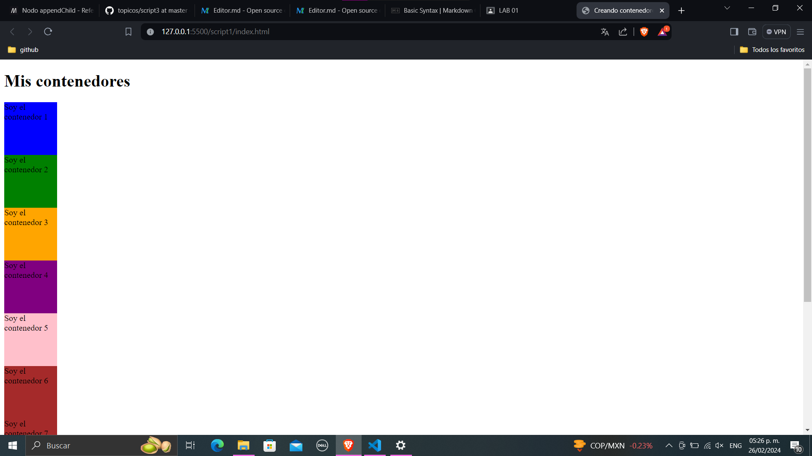
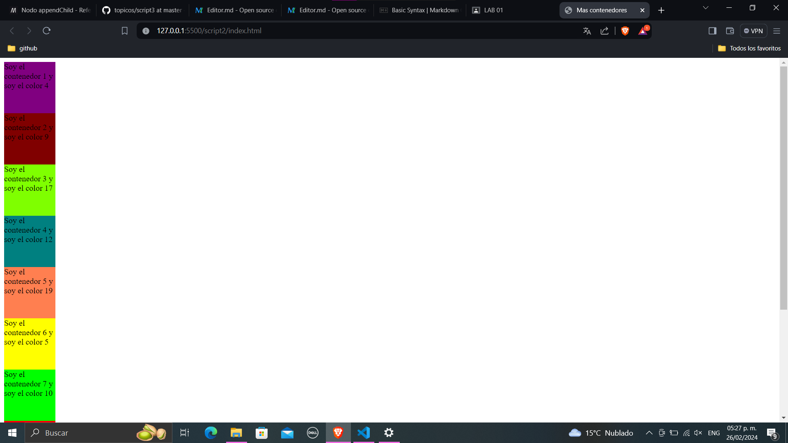
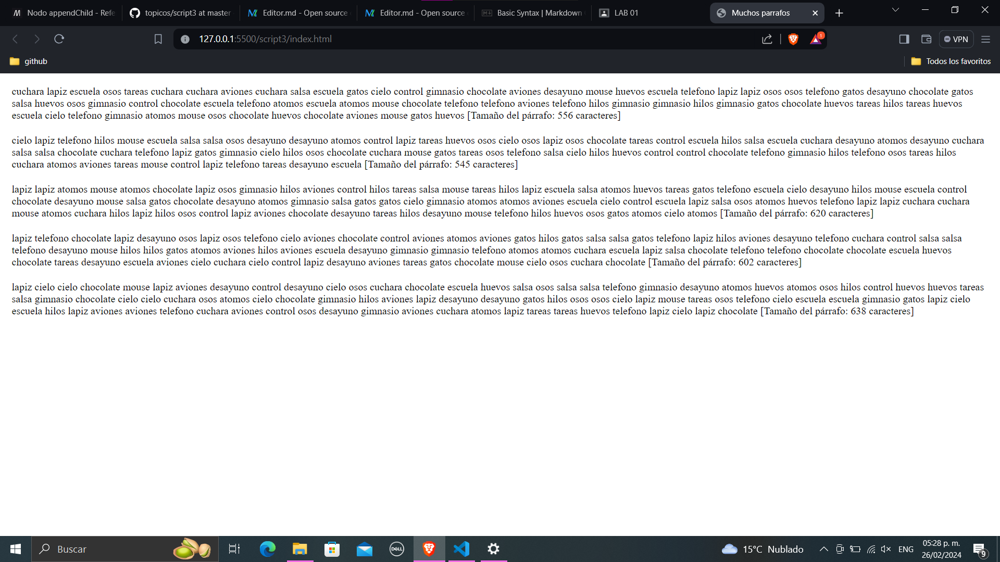

# Presentacion
### Contenido del repositorio de topicos
En este repositorio se encontraran tres scripts, cada uno es una parte de la actividad del lab 01.
- En el script1 se generan 10 contenedores y se les asigna un color a cada uno.

- En el script numero dos se realiza la misma tarea pero con un reto adicional, los colores no pueden ser repetidos.

- El utlimo script, el numero 3, genera un parrafo con palabras aleatorias en un cierto rango de palabras que nosotros definimos, y los imprime en la pantalla.
